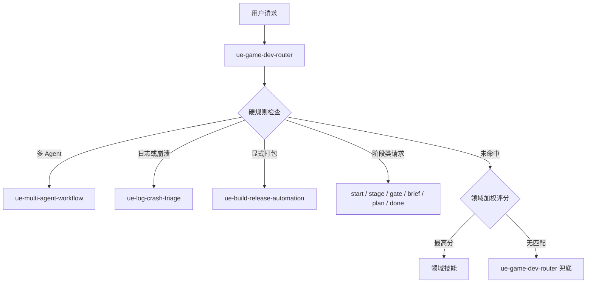

# UE Game Dev Architecture

## Routing Flow



## Key Boundaries

- `skills/ue-game-dev-router/SKILL.md` is the human-readable routing contract.
- `scripts/validate_plugin.py` mirrors that contract for route scenario validation.
- Root plugin files are the source of truth; `plugins/ue-game-dev/` is generated by `scripts/sync_marketplace_package.py`.
- Automatic packaging remains explicit-only. Readiness checks, diagnostics, and packaging failures must not silently route to `$ue-build-release-automation`.

## Release Checks

Run this sequence before committing plugin changes:

```powershell
$env:PYTHONUTF8='1'
python scripts\sync_marketplace_package.py
python scripts\validate_plugin.py
python -m unittest discover tests
git diff --check
```
