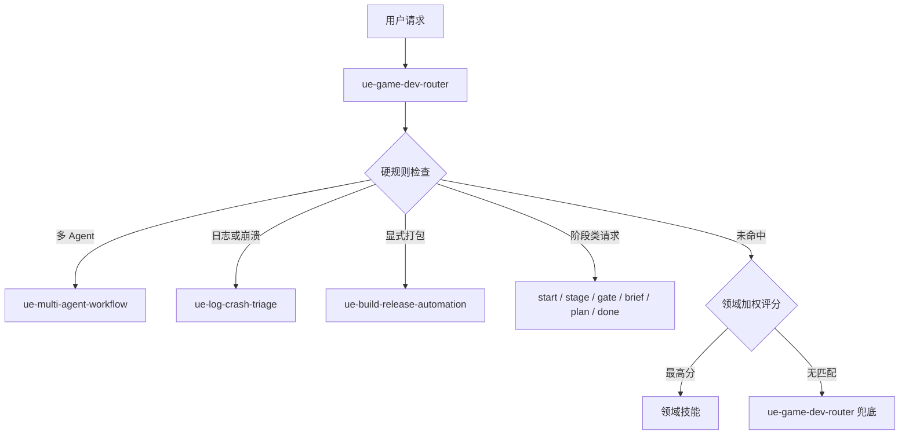

# UE Game Dev 架构

## 路由流程



## 关键边界

- `skills/ue-game-dev-router/SKILL.md` 是给 Agent 阅读的人类路由契约。
- `scripts/validate_plugin.py` 用测试路由镜像这份契约，防止路由场景回退。
- 根目录插件文件是源头，`plugins/ue-game-dev/` 由 `scripts/sync_marketplace_package.py` 生成。
- 自动打包必须保持显式触发。发布准备、诊断和打包失败不能静默进入 `$ue-build-release-automation`。

## 发布检查

提交插件改动前运行：

```powershell
$env:PYTHONUTF8='1'
python scripts\sync_marketplace_package.py
python scripts\validate_plugin.py
python -m unittest discover tests
git diff --check
```
